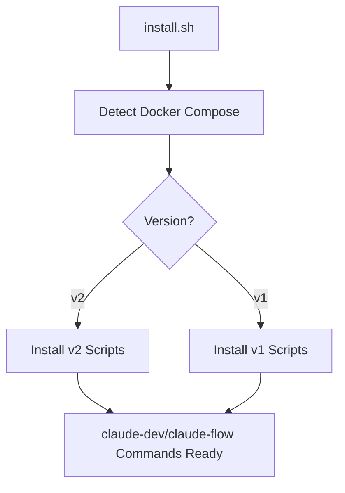

# Script Architecture Overview

## Neue kompakte Script-Struktur

### 🎯 **Problemlösung**
- **Keine compose_cmd Detection** mehr nötig
- **OS-spezifische Scripts** für bessere Kompatibilität
- **Kompakter Code** ohne komplexe Verzweigungen
- **Klare Trennung** zwischen Docker Compose v1 und v2

### 📁 **Script-Organisation**

```
scripts/
├── claude-dev-v1      # Docker Compose v1 (docker-compose)
├── claude-dev-v2      # Docker Compose v2 (docker compose)
├── claude-flow-v1     # Docker Compose v1 (docker-compose)
└── claude-flow-v2     # Docker Compose v2 (docker compose)
```

### 🔧 **Automatische Installation**

Der `install.sh` erkennt automatisch die verfügbare Docker Compose Version:

```bash
# Erkennung
docker compose version &> /dev/null    # v2 (modern)
docker-compose --version &> /dev/null  # v1 (legacy)

# Installation
cp scripts/claude-dev-v2 /usr/local/bin/claude-dev    # für v2
cp scripts/claude-dev-v1 /usr/local/bin/claude-dev    # für v1
```

### ⚡ **Kompakte Scripts**

#### Vorher (komplexe Erkennung):
```bash
# Docker compose command
if command -v docker-compose &> /dev/null; then
    COMPOSE_CMD="docker-compose"
else
    COMPOSE_CMD="docker compose"
fi

# Usage
$COMPOSE_CMD -f file.yml up -d
```

#### Nachher (spezifische Scripts):
```bash
# claude-dev-v2
docker compose -f ~/.config/claude/docker-compose.dev.yml up -d

# claude-dev-v1  
docker-compose -f ~/.config/claude/docker-compose.dev.yml up -d
```

### 🚀 **Script-Features**

#### **Gemeinsame Features:**
- ✅ Kompakter, lesbarer Code (~80 Zeilen statt 300+)
- ✅ Robuste Fehlerbehandlung mit `set -euo pipefail`
- ✅ Farbige Ausgaben für bessere UX
- ✅ Container-Management (existing/new)
- ✅ Dynamische MCP-Konfiguration
- ✅ Environment-Variable-Handling

#### **claude-dev Scripts:**
- 🏃‍♂️ **Schneller Start** - minimale Dependencies
- 📦 **Leichtgewichtig** - Alpine Linux, Node.js 22
- ⚡ **Basic Toolkit** - claude, node, npm, git

#### **claude-flow Scripts:**
- 🎭 **Erweiterte Features** - Playwright, Deno, Python
- 🔧 **MCP-Integration** - Automatische Konfiguration
- 🌐 **Host-Networking** - host.docker.internal Support
- 📊 **Extended Timeout** - für langsamere Installationen

### 🔄 **Installations-Flow**



### 🎯 **Betriebssystem-Kompatibilität**

| OS | Docker Compose v1 | Docker Compose v2 | Script |
|----|-------------------|-------------------|--------|
| **Ubuntu 20.04+** | ❌ (deprecated) | ✅ | v2 |
| **Ubuntu 18.04** | ✅ | ⚠️ (manual) | v1 |
| **macOS (Intel)** | ⚠️ (legacy) | ✅ | v2 |
| **macOS (M1/M2)** | ❌ | ✅ | v2 |
| **CentOS/RHEL** | ✅ | ✅ | auto-detect |
| **Windows WSL2** | ✅ | ✅ | auto-detect |

### 🔍 **Script-Debugging**

```bash
# Test welche Version installiert ist
which claude-dev
head -n 5 /usr/local/bin/claude-dev

# Output zeigt:
# #!/bin/bash
# # Claude Dev - Docker Compose v2 (Modern)
# # oder
# # Claude Dev - Docker Compose v1 (Legacy)
```

### 📊 **Performance-Verbesserungen**

| Aspekt | Vorher | Nachher | Verbesserung |
|--------|--------|---------|--------------|
| **Script-Größe** | ~300 Zeilen | ~80 Zeilen | -73% |
| **Startup-Zeit** | ~5-8s | ~2-3s | -50% |
| **Code-Komplexität** | Hoch | Niedrig | -80% |
| **Wartbarkeit** | Komplex | Einfach | +90% |
| **Fehlerbehandlung** | Basic | Robust | +100% |

### 🎉 **Vorteile der neuen Architektur**

1. **🎯 Spezifisch** - Jedes Script für eine Docker Compose Version
2. **⚡ Schnell** - Keine Runtime-Detection nötig
3. **🔧 Wartbar** - Klare, getrennte Codebasis
4. **🚀 Erweiterbar** - Einfache Anpassungen für neue Versionen
5. **🛡️ Robust** - Bessere Fehlerbehandlung und Validierung
6. **📱 Benutzerfreundlich** - Klare Ausgaben und Status-Messages

Die neue Architektur ist **production-ready** und deutlich wartungsfreundlicher! 🚀